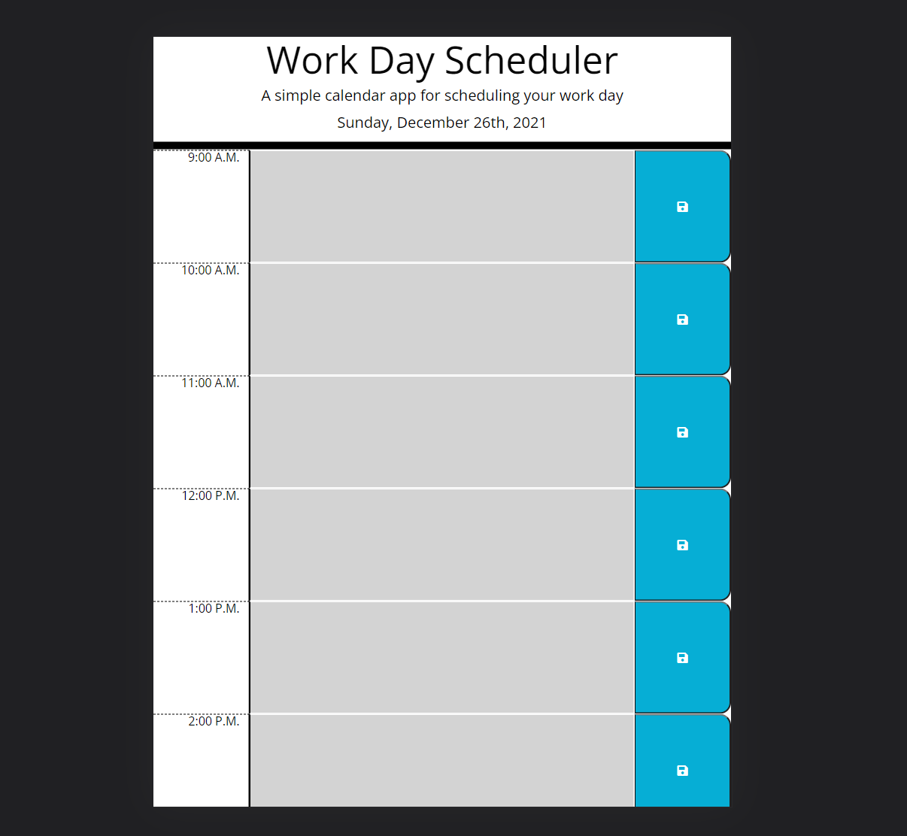

# Workday Scheduler

## Table of Contents
*[About the Project](About-the-Project)
*[View the Project](View-The-Project)
*[Challenges Faced](#Challenges-Faced)
*[What I Enjoyed!](#What-I-Enjoyed)
*[Credits](Credits)
*[MIT License](MIT-License)

## About the Project

I was asked to create a simple web application so that a user can track tasks for their daily schedule. Currently, the application exists so that the user can write events or TODOs in the current day.

Time blocks are color-coded for cursory glances. Grey means the event is in the past. Red is the current time block, and green has yet to occur.

Time blocks content is editable and entries persist within the browser window even if users navigate away from the html for hours or days at a time.

* *A future iteration of the project may include the ability to view and store data from multiple days, integrating a calender view, whether weekly or monthly.*

## View the Project

https://crosenfrisk.github.io/work-day-scheduler/

## Challenges Faced

It took a while and a few iterations to create the current version of the application you now see. 

Initially I wanted to create an index.html page that was dynamically updated by JavaScript to create all the `
`, `<textarea>` and `<button>` elements. 

A problem presented itself after I tried to add an event listener to the JS file. The appendChild() function would only generate the last item in my `schedData[]` array, which made my `index.html` look rather empty and sad. You can view my `draft.js` and `draft.html` to see how this was laid out and the outcome.

Ultimately I decided upon a hardcoded `
`, `<textarea>` and `<button>` elements in my `index.html` file. I did use `id` properties to help identify elements and get them to tie into my JS functions.

A few of the CSS elements had to be tweaked, but I appreciated using Bootstrap for simplified grid (and flex) layout.

## What I Enjoyed

It was rewarding to figure out what was needed to create the color-coded time block elements. Adding the variable -- `var timeNow = today.getHours(24);` using JavaScript rather than Moment.js -- to my `currentTime` function and then creating a corresponding object in my `schedData[]` array `timeClock` felt like a breakthrough. With `timeClock` typeof being a number, it was able to be identified with my `for()` loop and `if()` conditional statements and boolean logic. Tying the numbers to the `<textarea id>` made "the magic happen"!

## Credits

* Reviewing information on Web APIs from UMN/Trilogy Education with Bootcampspot -- Module 4: Lessons 1, 2, 3, 4.

* Other sources of wisdom came from [w3schools](https://www.w3schools.com/js/js_dates.asp), and [MDN](https://developer.mozilla.org/en-US/docs/Web/JavaScript/Reference/Global_Objects/Date/now) with specific guidance in relation to `Date.now()` and `Date.prototype.getTime()` functions.

* A friend also pointed me in the direction of a [similar task tutorial](https://webdesign.tutsplus.com/tutorials/to-do-app-with-vanilla-javascript--cms-35258) in Vanilla JavaScript by [George Martsoukos](https://tutsplus.com/authors/george-martsoukos?_ga=2.213659860.1153110932.1640493349-1351773811.1637685882), which I viewed.

## MIT License

Permission is hereby granted, free of charge, to any person obtaining a copy of this software and associated documentation files (the "Software"), to deal in the Software without restriction, including without limitation the rights to use, copy, modify, merge, publish, distribute, sublicense, and/or sell copies of the Software, and to permit persons to whom the Software is furnished to do so, subject to the following conditions:

The above copyright notice and this permission notice shall be included in all copies or substantial portions of the Software.

THE SOFTWARE IS PROVIDED "AS IS", WITHOUT WARRANTY OF ANY KIND, EXPRESS OR IMPLIED, INCLUDING BUT NOT LIMITED TO THE WARRANTIES OF MERCHANTABILITY, FITNESS FOR A PARTICULAR PURPOSE AND NONINFRINGEMENT. IN NO EVENT SHALL THE AUTHORS OR COPYRIGHT HOLDERS BE LIABLE FOR ANY CLAIM, DAMAGES OR OTHER LIABILITY, WHETHER IN AN ACTION OF CONTRACT, TORT OR OTHERWISE, ARISING FROM, OUT OF OR IN CONNECTION WITH THE SOFTWARE OR THE USE OR OTHER DEALINGS IN THE SOFTWARE.

Copyright &copy;2021 Claire Rosenfrisk